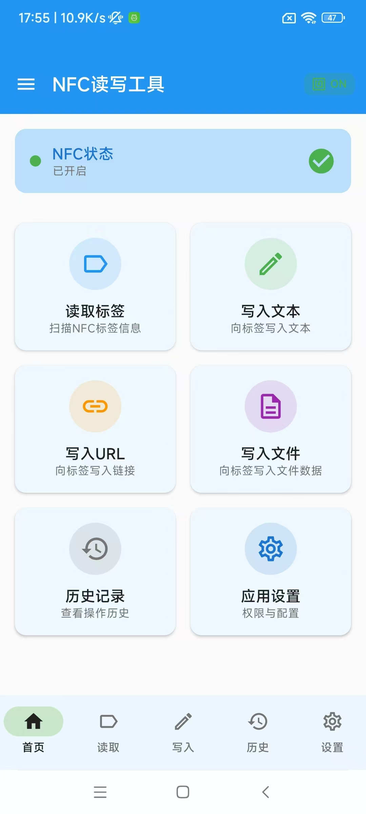

# NFC读写工具 (NFC Reader & Writer)

一款功能完整的Android NFC读写工具应用，支持读取NFC标签信息、写入多种数据类型（文本、URL、文件）、历史记录管理等核心功能。

## 截屏


## 功能特性

### 🏠 主页
- NFC状态实时显示
- 6个功能入口卡片
- 快速操作提示

### 📖 读取标签
- 扫描动画效果
- 显示标签ID、类型、容量
- 三种视图：文本、十六进制、技术详情
- 支持复制、保存、分享、擦除操作

### ✏️ 写入数据
- 四种写入模式：文本、URL、文件、自定义
- 字符编码选择（UTF-8、GBK、ASCII）
- 标签锁定选项
- 写入进度动画

### 📜 历史记录
- 按日期分组显示
- 支持类型和时间筛选
- 滑动删除
- 详情查看

### ⚙️ 设置
- NFC状态管理
- 权限管理
- 应用偏好设置
- 关于信息

## 技术栈

- **语言**: Kotlin
- **UI框架**: Jetpack Compose + Material Design 3
- **架构模式**: MVVM + Clean Architecture
- **依赖注入**: Hilt
- **数据库**: Room
- **异步处理**: Kotlin Coroutines + Flow
- **导航**: Navigation Compose

## 项目结构

```
app/
├── data/
│   ├── local/
│   │   ├── dao/          # 数据访问对象
│   │   ├── entity/       # 数据库实体
│   │   └── database/     # Room数据库
│   ├── repository/       # 仓库实现
│   └── preferences/      # 偏好设置
├── domain/
│   ├── model/           # 领域模型
│   └── usecase/         # 用例
├── presentation/
│   ├── home/            # 主页
│   ├── read/            # 读取页
│   ├── write/           # 写入页
│   ├── history/         # 历史记录页
│   ├── settings/        # 设置页
│   ├── navigation/      # 导航
│   ├── components/      # 通用组件
│   └── theme/           # 主题
├── di/                  # 依赖注入模块
└── util/                # 工具类
```

## 系统要求

- **最低SDK**: Android 5.0 (API 21)
- **目标SDK**: Android 14 (API 34)
- **必需硬件**: NFC芯片

## 构建说明

### 本地构建

1. 克隆项目
2. 使用Android Studio打开 `NFCReaderApp` 目录
3. 同步Gradle依赖
4. 连接支持NFC的Android设备
5. 运行应用

```bash
./gradlew assembleDebug
```

### GitHub Actions 自动构建

本项目已配置 GitHub Actions，支持自动构建：

#### 自动触发
- **推送代码**: 推送到 `main`、`master` 或 `develop` 分支时自动构建
- **Pull Request**: 向 `main` 或 `master` 分支提交 PR 时自动构建
- **发布版本**: 推送 `v*` 格式的 tag 时自动创建 Release（如 `v1.0.0`）

#### 手动触发
1. 进入 GitHub 仓库的 **Actions** 页面
2. 选择 **Android Build** 或 **Release Build** 工作流
3. 点击 **Run workflow** 按钮

#### 下载 APK
1. 构建完成后，进入对应的 workflow run
2. 在 **Artifacts** 部分下载：
   - `app-debug` - Debug 版本 APK
   - `app-release-unsigned` - 未签名的 Release 版本 APK

#### 配置签名（可选）
如需自动签名 Release APK，在仓库 Settings > Secrets 中添加：
- `KEYSTORE_BASE64`: keystore 文件的 Base64 编码
- `KEYSTORE_PASSWORD`: keystore 密码
- `KEY_ALIAS`: 密钥别名
- `KEY_PASSWORD`: 密钥密码

生成 Base64 编码：
```bash
base64 -i your-keystore.jks | tr -d '\n'
```

## 权限说明

应用需要以下权限：

- `android.permission.NFC` - NFC功能
- `android.permission.VIBRATE` - 振动反馈
- `android.permission.POST_NOTIFICATIONS` - 通知权限

## 支持的NFC标签类型

| 类型 | 容量 | 用途 |
|------|------|------|
| NTAG213 | 144 bytes | 通用标签 |
| NTAG215 | 504 bytes | 游戏、门禁 |
| NTAG216 | 888 bytes | 大容量应用 |
| Mifare Classic 1K | 1KB | 交通卡 |
| Mifare Ultralight | 64 bytes | 一次性标签 |

## 许可证

MIT License

## 版本信息

- **版本**: 1.0.0
- **构建日期**: 2025-01-08
- **开发者**: NFC Tools Team
